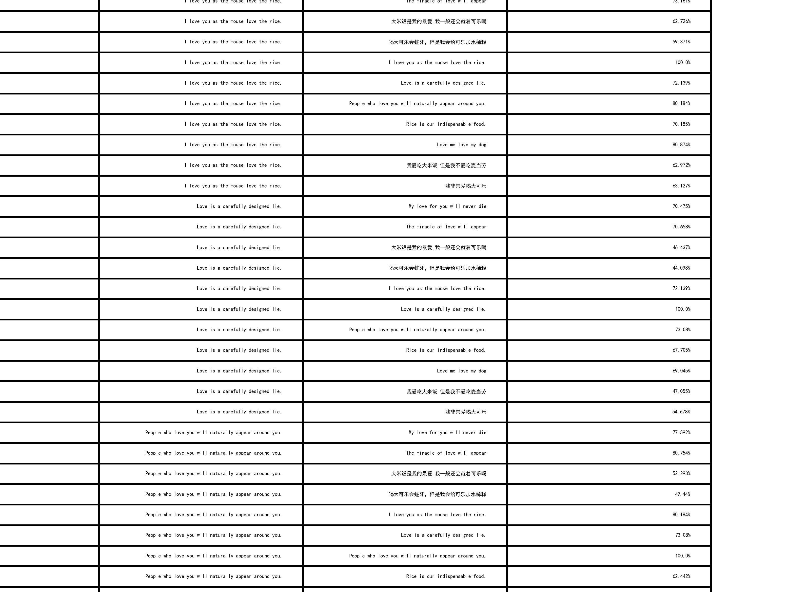

# DataScience HomeWork

## HW1 Text Similarity

Solution: Word Embedding + Cosine Similarity Implementation Steps:

- Get each word's token id and attention_mask by using Tokenizer
- Input the token id into the BertModel and then get each word's embedding
- Use `attention_mask*embedding` to get the masked embedding, it will mask the words which are shouldn't be attended to
- Sum all the words' embedding which is in one sentence, and calculate the mean of them, then get the embedding for one
  sentence
- Calculate the cosine similarity between each sentence

Result:

References:
1. Briggs, J. (2021, May 5). BERT For Measuring Text Similarity. Retrieved from https://towardsdatascience.com/bert-for-measuring-text-similarity-eec91c6bf9e1